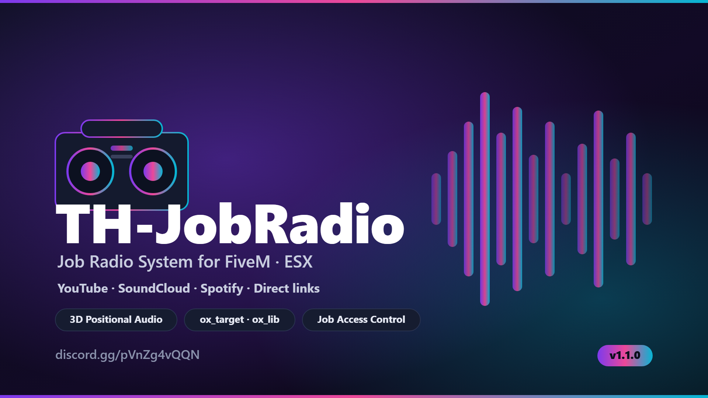

  

  A job-based world radio for FiveM (ESX). Place a radio prop, control it with
  ox_target, and stream music from YouTube, SoundCloud, Spotify or a direct link
  — with live volume, adjustable range and full 3D positional audio.

  
  
  

---

## ✨ Features

- 🎚️ **Aim-to-place** props with a live ghost preview and surface snapping.
- 🎯 **ox_target** control — set a link, adjust volume (0–100%) and audible range.
- 🎵 **YouTube / SoundCloud / Spotify** and direct links (resolved with yt-dlp).
- 🔊 **3D audio** that fades over range; only decodes for players nearby.
- 💾 **Persistent** — radios (and their music) survive a restart.
- 🔐 **Access control** per radio: jobs with a minimum grade and/or specific players.
- 🛠️ **Admin menu** — list, teleport to, stop or delete any radio.
- 🔇 **Streamer mute** — any player can silence radios for themselves.
- 🌍 **4 languages** included (NL / EN / FR / DE), easily extendable.

## 📦 Get it

| Version | What you get | Price | Link |
|---------|--------------|-------|------|
| **Free** | Ready-to-use, encrypted build | Free | *( https://t-h-i-b-l-o-o-t-n.tebex.io/package/7547534 )* |
| **Open source** | Full editable source code | €5 | *( https://t-h-i-b-l-o-o-t-n.tebex.io/package/7547539 )* |

## 🧩 Dependencies

[ox_lib](https://github.com/overextended/ox_lib) ·
[ox_target](https://github.com/overextended/ox_target) ·
[xsound](https://github.com/Xogy/xsound) ·
[oxmysql](https://github.com/overextended/oxmysql) · ESX

## 🖼️ Preview

*(Add screenshots / a short GIF of placing a radio and the /radioadmin menu here.)*

## 💬 Support

Questions or issues? Join the Discord: **https://discord.gg/pVnZg4vQQN**

## 📄 License

Licensed under the terms in [LICENSE.md](LICENSE.md). Redistribution or resale of
the source is not permitted.

Built by THIBLOOTN · Audio by xsound · Link resolving by yt-dlp

